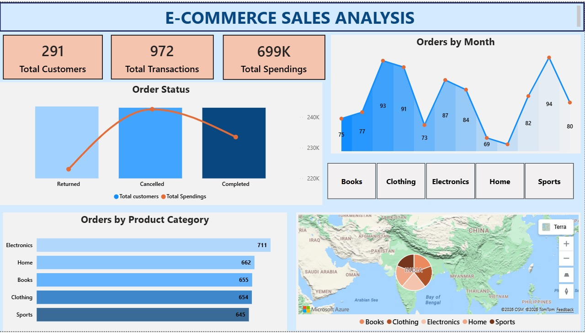

# 🛒E-Commerce Analytics

_A real-world Data Analytics Project workflow using dbt, PostgreSQL, Docker, and Python to transform raw e-commerce transaction data into analytics-ready datasets and then turning this data into visual insights using PowerBI ._

---

## 📌 Table of Contents
- <a href="#overview">Overview</a>
- <a href="#business-problem">Business Problem</a>
- <a href="#dataset">Dataset</a>
- <a href="#tools--technologies">Tools & Technologies</a>
- <a href="#project-structure">Project Structure</a>
- <a href="#data-cleaning--preparation">Data Cleaning & Preparation</a>
- <a href="#data-modeling">Data Modeling</a>
- <a href="#research-questions--key-findings">Research Questions & Key Findings</a>
- <a href="#dashboard">Dashboard</a>
- <a href="#dbt-models-query-measures">dbt Models Query Measures</a>
- <a href="#conclusion">Conclusion</a>
- <a href="#author--contact">Author & Contact</a>

---
<h2><a class="anchor" id="overview"></a>Overview</h2>

- This project demonstrates a real-world Analytics Engineering workflow using dbt, PostgreSQL, Docker, and Python to transform raw e-commerce transaction data into analytics-ready datasets.

- The pipeline follows the Medallion Architecture (Bronze → Silver → Gold) to progressively clean, validate, and model the data before delivering it for Business Intelligence dashboards in Power BI.

- The final output is a Star Schema data model enabling business teams to analyze sales trends, customer behavior, product performance, and regional sales distribution.

---
<h2><a class="anchor" id="business-problem"></a>Business Problem</h2>

- This project solves the business problems such as:
 - 📈 How is revenue trending across months?
 - 🛍 Which product categories perform best?
 - 🌍 Which countries generate the highest sales?
 - 🔎 Are there data quality issues affecting reports?
 - 📊 How can clean datasets be delivered for BI dashboards?

This project simulates how analytics engineers build trusted data layers for business analytics.

---
<h2><a class="anchor" id="dataset"></a>Dataset</h2>

- CSV file located in `/seed/` folder (ecommerce_sales)

---

<h2><a class="anchor" id="tools--technologies"></a>Tools & Technologies</h2>

- Python (Synthetic dataset generation)
- PostgreSQL (Data warehouse)
- dbt Core (Data transformation)
- Docker (Containerized environment)
- Docker Compose (Multi-service orchestration)
- SQL (Transformation logic)
- Power BI (Data visualization)

---
<h2><a class="anchor" id="project-structure"></a>Project Structure</h2>

```
ecommerce_analytics
│
├── README.md
├── requirements.txt
│
├── data
│   └── ecommerce_sales.csv
│
├── dashboards
│   └── powerbi_dashboard.pbix
│
├── python
│   └── generate_synthetic_data.py
│
├── dbt_project
│   │
│   ├── models
│   │   ├── bronze
│   │   │   └── br_ecommerce_sales.sql
│   │   │
│   │   ├── silver
│   │   │   └── sl_ecommerce_sales.sql
│   │   │
│   │   ├── gold
│   │   │   ├── fact_sales.sql
│   │   │   ├── dim_customers.sql
│   │   │   ├── dim_products.sql
│   │   │   └── dim_date.sql
│   │
│   ├── tests
│   │   ├── unique_transaction_id.sql
│   │   └── valid_price.sql
│   │
│   └── schema.yml
│
├── docker
│   ├── Dockerfile
│   └── docker-compose.yml
│
└── screenshots
    └── dashboard.png
```

---
<h2><a class="anchor" id="data-cleaning--preparation"></a>Data Cleaning & Preparation</h2>

Data transformation steps included:
**Medallion Architecture Layers**

**- 🥉 Bronze Layer**
**Raw ingestion layer**
  - Data loaded directly from CSV files
  - Minimal transformation
  - Acts as source of truth

**- 🥈 Silver Layer**
**Data cleaning and transformation layer.**
- Key transformations:
  - Remove duplicates using SQL Window Functions
  - Standardize categorical values
  - Handle invalid country values
  - Remove negative quantities/prices
  - Validate order dates

**- 🥇 Gold Layer**
**Analytics-ready datasets built using Star Schema modeling.**

---
<h2><a class="anchor" id="data-modeling"></a>Data Modeling</h2>

**🐳 Infrastructure Setup**
Docker was used to create a reproducible analytics environment.
**docker-compose.yml**
```bash
</> YAML
services:
 postgres:
   image: postgres:15
   container_name: dbt_postgres
```

**🔄 Data Pipeline Workflow**
1) Generate synthetic e-commerce dataset using Python
2) Inject data quality issues intentionally
3) Load CSV data into PostgreSQL using dbt seeds
4) Transform raw data into Bronze layer
5) Clean and validate data in Silver layer
6) Create Star Schema in Gold layer
7) Connect Power BI to analytics tables
8) Build dashboard for business insights


---
<h2><a class="anchor" id="research-questions--key-findings"></a>Research Questions & Key Findings</h2>

**- Several challenges were encountered during the project:**
- Handling inconsistent raw data values.
- Removing duplicate transactions efficiently.
- Structuring transformations using modular dbt models.
- Designing a scalable data model suitable for BI reporting.

- These challenges were addressed using SQL window functions, validation rules, and layered data modeling techniques.

**- Analysis of the processed data revealed several insights:**
- The Electronics category generated the highest order volume.
- Monthly orders showed seasonal variation with peak periods.
- The majority of orders were completed transactions.
- Some geographical entries required normalization due to inconsistent country values.

- These insights demonstrate how analytics-ready datasets support better decision-making.


---
<h2><a class="anchor" id="dashboard"></a>Dashboard</h2>

**- 📊 Power BI Dashboard**
- The final dashboard provides insights into:
  - Key Metrics
  - Total Customers
  - Total Transactions
  - Total Revenue

**Analytics Visualizations**
- 📈 Orders by Month
- 📦 Orders by Product Category
- 📍 Country Sales Distribution
- 📊 Order Status Analysis




---
<h2><a class="anchor" id="dbt-models-query-measures"></a>dbt Models Query Measures</h2>

**Model 1: Bronze Layer**
- Purpose:
  - Raw ingestion
  - Minimal transformation

```bash
br_ecommerce_sales.sql
```
```bash
</>SQL
SELECT
    transaction_id,
    order_date,
    customer_id,
    customer_name,
    country,
    product_id,
    product_category,
    quantity,
    price,
    order_status
FROM {{ ref('ecommerce_sales') }}
```
**Model 2: Silver Layer (Cleaning + Deduplication)**
- This shows:
  - Deduplication
  - Data cleaning
  - Data validation
  - SQL window functions

```bash
sl_ecommerce_sales.sql
```
```bash
</>SQL
WITH cleaned_data AS (
SELECT
    transaction_id,
    order_date,
    customer_id,
    customer_name,
    CASE
        WHEN country NOT IN ('US','UK','IN','DE','FR','CA','AU')
        THEN 'Unknown'
        ELSE country
    END AS country,
    product_id,
    product_category,
    quantity,
    price,
    order_status,

ROW_NUMBER() OVER(
    PARTITION BY transaction_id
    ORDER BY order_date
) AS rn

FROM {{ ref('br_ecommerce_sales') }}

WHERE quantity > 0
AND price > 0
AND customer_id IS NOT NULL
)

SELECT *
FROM cleaned_data
WHERE rn = 1
```

**Model 3: Gold Layer (Fact Table)**
```bash
fact_sales.sql
```
```bash
</>SQL
SELECT
    transaction_id,
    order_date,
    customer_id,
    product_id,
    quantity,
    price,
    quantity * price AS revenue,
    order_status
FROM {{ ref('sl_ecommerce_sales') }}
```

---
<h2><a class="anchor" id="conclusion"></a>Conclusion</h2>

Modern data teams rely on Analytics Engineers to bridge the gap between data engineering and business analytics.
- This project demonstrates how to:
 - Structure production-style dbt projects
 - Enforce data quality checks
 - Build scalable transformation pipelines
 - Deliver reliable analytics datasets for decision-making

---
<h2><a class="anchor" id="author--contact"></a>Author & Contact</h2>

**Shruti Bade**    
📧 Email: shrutibade12@gmail.com  
🔗 [LinkedIn](https://www.linkedin.com/in/shruti-bade)  
